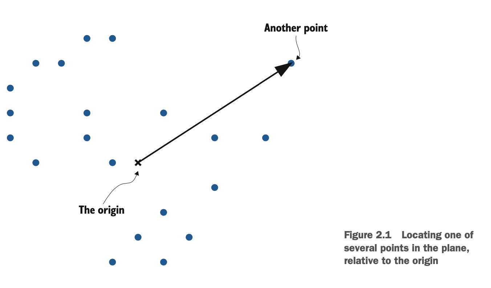
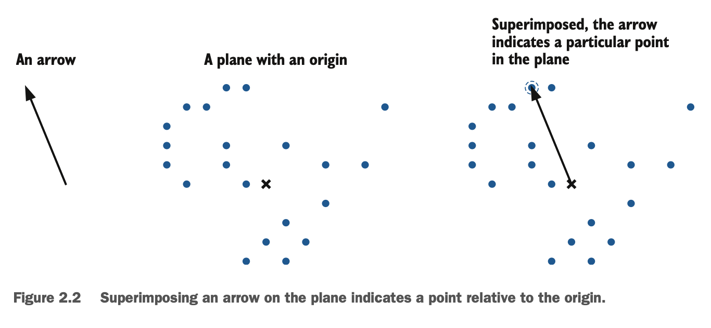
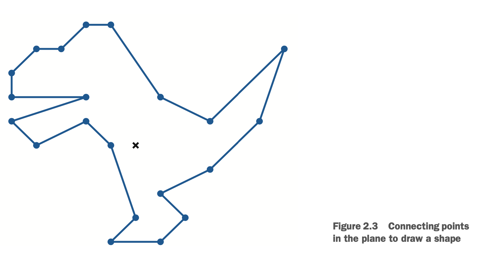
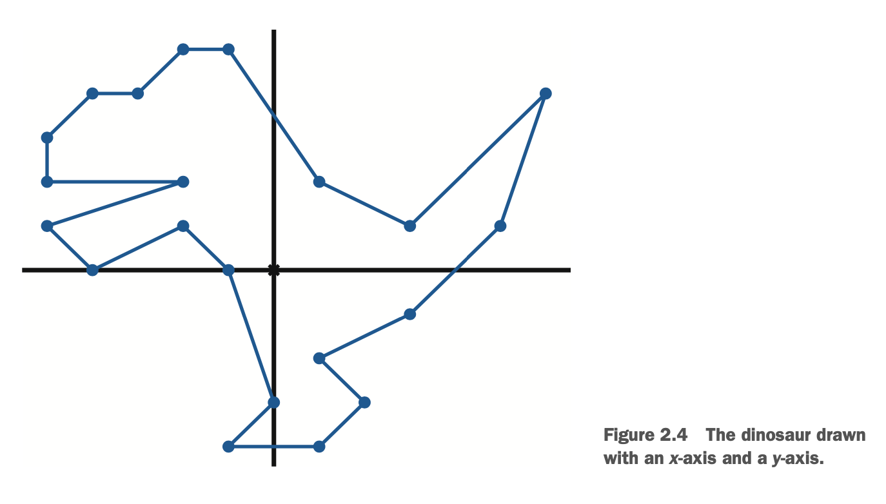
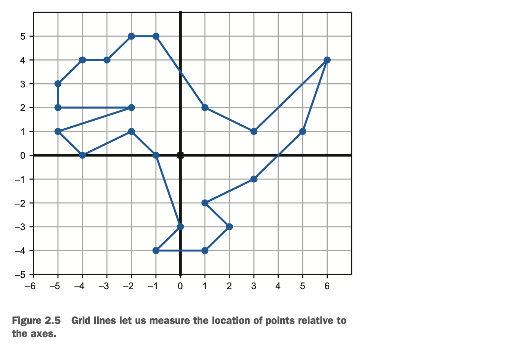
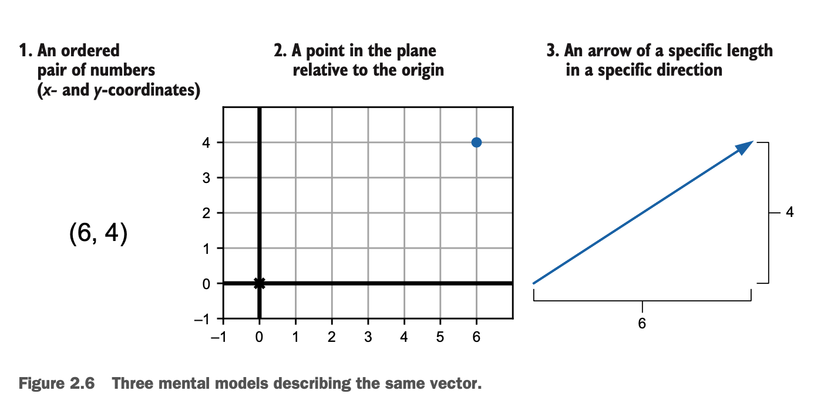
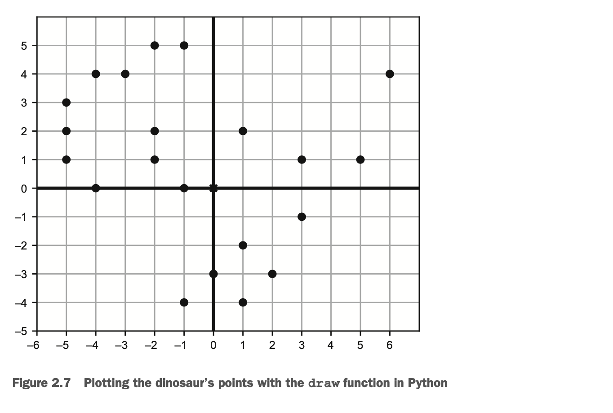
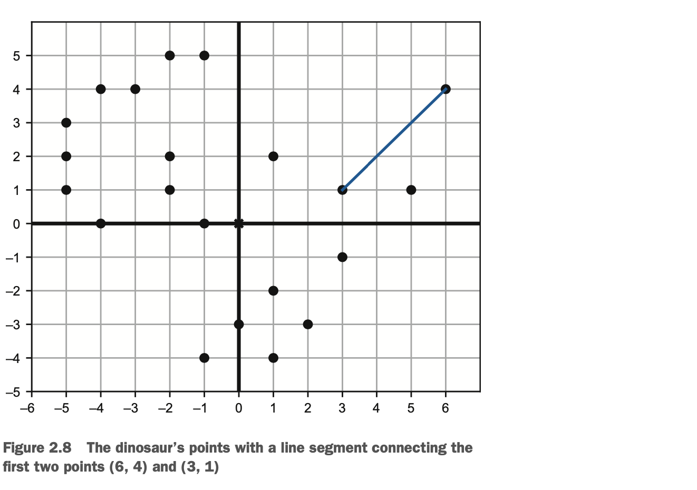
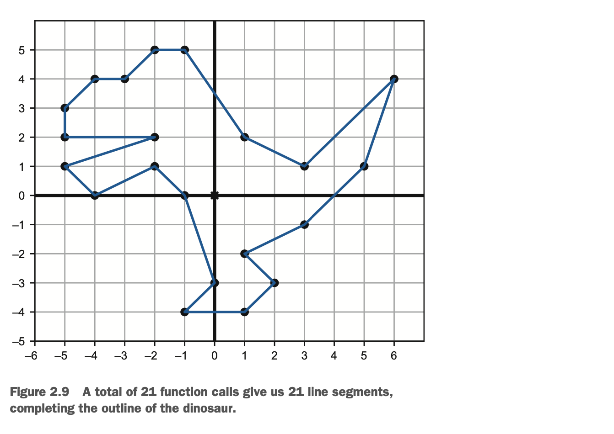

# Drawing with 2D vectors
# 2D 向量绘图

You probably already have some intuition for what it means to be two-dimensional or three-dimensional. A two-dimensional (2D) object is flat like an image on a piece of paper or a computer screen. It has only the dimensions of height and width. A three-dimensional (3D) object in our physical world, however, has not only height and width but also depth.

你也许对二维或三维的概念已经有一些直观认识。二维（2D）对象就像一页纸或者电脑屏幕上的图片，是扁平的。它只有宽度和高度两个维度。然而，我们物理世界中的三维（3D）对象，不仅有宽度和高度，还有深度。

Models of 2D and 3D entities are important in programming. Anything that shows up on the screen of your phone, tablet, or PC is a 2D object, occupying some width and height of pixels. Any simulation, game, or animation that represents the physical world is stored as 3D data and eventually projected to the two dimensions of the screen. In virtual and augmented reality applications, the 3D models must be paired with real, measured 3D data about the user’s position and perspective.

2D 和 3D 实体模型对编程而言举足轻重。你手机、平板电脑或者 PC上呈现的任何东西都是 2D 对象，都具有一些像素的宽和高。而一些仿真、游戏或者动画呈现的物理世界，是存储为 3D 数据，并最终被投影到二维的屏幕上。VR 和 AR 应用中，3D 模型必须和真实的测量过的，跟用户的位置和视角相关的 3D 数据匹配。

Even though our everyday experience takes place in three dimensions, it's useful to think of some data as higher dimensional. In physics, it’s common to consider time as the fourth dimension. While an object exists at a location in 3D space, an event occurs at a 3D location and at a specified moment. In data science problems, it’s common for data sets to have far more dimensions. For instance, a user tracked on a website can have hundreds of measurable attributes, which describe usage patterns. Grappling with these problems in graphics, physics, and data analysis requires a framework for dealing with data in higher dimensions. This framework is vector mathematics.

尽管我们每天都生活在三维空间中，从更高维度来看待一些数据大有裨益。物理学上通常认为时间是第四维度。当一个 对象位于 3D 空间中，某个事件在某一特定时刻发生在某一个 3D 位置。数据科学问题中，数据集拥有远不止四个维度。举个例子，用户浏览一个网站可以有数百个可测量的描述使用规律的属性。想要解决这些图形学、物理学和数据分析上的问题，要求一个站在更高维度来处理数据的框架。这个框架就是向量数学。

Vectors are objects that live in multi-dimensional spaces. These have their own notions of arithmetic (adding, multiplying, and so on). We start by studying 2D vectors, which are easy to visualize and compute with. We use a lot of 2D vectors in this book, and we also use them as a mental model when reasoning about higher-dimensional problems.

向量就是多维空间中的对象。它们有自己的算法概念（加法、乘法等）。我们从易于可视化和计算的 2D 向量开始学习。本书中使用大量 2D 向量，并在推出更高维度问题时，将它们用于心智模型来辅助理解。

## 2.1 Picturing 2D vectors
## 2.1 2D 向量绘图

The 2D world is flat like a piece of paper or a computer screen. In the language of math, a flat, 2D space is referred to as a plane. An object living in a 2D plane has the two dimensions of height and width but no third dimension of depth. Likewise, you can describe locations in 2D by two pieces of information: their vertical and horizontal positions. To describe the location of points in the plane, you need a reference point. We call that special reference point the origin. Figure 2.1 shows this relationship.

2D 世界就像一页纸或者电脑屏幕一样扁平。用数学语言来说，平的 2D 空间被称为平面。2D 平面中的对象有宽度和高度两个维度，但没有深度这第三个维度。同样地，你可以通过两部分信息来描述 2D 中的位置：垂直和水平位置。要想描述点在平面中的位置，需要一个参考点。我们称这个特殊的点为原点。图 2.1 展示了这个关系。



There are many points to choose from, but we have to fix one of them as our origin. To distinguish it, we mark the origin with an x instead of with a dot as in figure 2.1. From the origin, we can draw an arrow (like the solid one in figure 2.1) to show the relative location of another point.

有很多点可以选择，但我们必须固定其中一个作为原点。为便于区分，我们在图 2.1 中使用 x 代表原点。从原点开始，可以画一个箭头（类似图 2.1 中那条实线）来表示和其他点的相对位置。

A two-dimensional vector is a point in the plane relative to the origin. Equivalently, you can think of a vector as a straight arrow in the plane; any arrow can be placed to start at the origin, and it indicates a particular point (figure 2.2).

二维向量是平面上相对于原点的一个点。相当于，你可以认为向量就是这个平面中的直箭头；任何箭头都可以放在原点开头，表示某个特定的点（图 2.2）。



We’ll use both arrows and points to represent vectors in this chapter and beyond. Points are useful to work with because we can build more interesting drawings out of them. If I connect the points in figure 2.2 as in figure 2.3, I get a drawing of a dinosaur:

从这章开始，我们将用箭头和点来表示向量。点很有用，因为我们可以用它们画出更多有趣的图。如果我像图 2.3 中那样连接图 2.2 中的点，会得到一个恐龙图：



Any time a 2D or 3D drawing is displayed by a computer, from my modest dinosaur to a feature-length Pixar movie, it is defined by points—or vectors—connected to show the desired shape. To create the drawing you want, you need to pick vectors in the right places, requiring careful measurement. Let’s take a look at how to measure vec- tors in the plane.

任何时候，计算机呈现的 2D 或 3D 图形，从我的简陋的恐龙到皮克斯动画长片，都是由点或者连接的向量来展示想要的形状。要创建想要的图形，就必须选择正确位置的向量，这需要精确的测量手段。一起来看看如何测量平面中的向量。

### 2.1.1 Representing 2D vectors

### 2.1.1 2D 向量表示

With a ruler, we can measure one dimension such as the length of an object. To mea- sure in two dimensions, we need two rulers. These rulers are called axes (the singular is axis), and we lay them out in the plane perpendicular to one another, intersecting at the origin. Drawn with axes, figure 2.4 shows that our dinosaur has the notions of up and down as well as left and right. The horizontal axis is called the x-axis and the vertical one is called the y-axis.

可以使用直尺测量出一个维度的数据，比如对象长度。要在二维平面中测量，就需要两个直尺。这两个直尺就是所谓的”坐标轴“（axes，单数是axis），把它们放在垂直于彼此的平面上，在原点相交。通过坐标轴，图 2.4 的恐龙图有了上下左右的概念。横轴被称为 x 轴，纵轴被称为 y 轴。



With axes to orient us, we can say things like, “Four of the points are above and to the right of the origin.” But we’ll want to get more quantitative than that. A ruler has tick marks that show how many units along it we’ve measured. Likewise, in our 2D drawing, we can add grid lines perpendicular to the axes that show where points lie relative to them. By convention, we place the origin at tick 0 on both the x - and y -axes (figure 2.5).

有了坐标轴来确定方向，我们可以说，”有四个点在原点的右上方“。但我们想要更多量化的数据。同样地，2D 图形中，可以添加垂直于轴线的网格线，以显示点相对于它们的位置。按惯例，原点的 x、y 轴值都为 0（图 2.5）。

In the context of this grid, we can measure vectors in the plane. For example, in figure 2.5, the tip of the dinosaur’s tail lines up with positive 6 on the x-axis and posi- tive 4 on the y-axis. We could think of these distances as centimeters, inches, pixels, or any other unit of length, but usually we leave the units unspecified unless we have a particular application in mind.

在这个网格线的上下文下，我们可以测量平面中的向量。举个例子，图 2.5 中，恐龙尾巴的尖端的x轴值为+6，y轴值为+4。可以认为这些距离是厘米、英寸、像素或者其他任何单位的长度，但通常我们不会使用特定单位，除非是特定场景应用下。



The numbers 6 and 4 are called the x- and y-coordinates of the point, and this is enough to tell us exactly what point we’re talking about. We typically write coordinates as an ordered pair (or tuple) with the x-coordinate first and the y-coordinate second, for example, (6, 4). Figure 2.6 shows how we can now describe the same vector in three ways.

数字 6 和 4 被称为点的 x 和 y 坐标，这足以告诉我们在讨论的是哪个点。我们一般将坐标写成一个[x, y]的有序数对（或者叫元组），比如（6, 4）。图 2.6 展示了现在如何以三种形式描述同一向量。



From another pair of coordinates like (–3, 4.5), we can find the point in the plane or the arrow that represents them. To get to the point in the plane with these coordinates, start at the origin and then travel three grid lines to the left (because the x-coordinate is –3) and then four and a half grid lines up (where the y-coordinate is 4.5). The point won’t lie at the intersection of two grid lines, but that’s fine; any pair of real numbers gives us some point on the plane. The corresponding arrow will be the straight-line path from the origin to that location, which points up and to the left (northwest, if you prefer). Try drawing this example for yourself as practice!

通过另一些坐标，比如（-3, 4.5），我们可以发现平面中的表示它们的点或者箭头。要用这个坐标到达平面上的对应点，从原点开始，然后向左移动三条网格线（因为 x 坐标是 -3），然后向上移动四条半网格线（y 坐标是 4.5）。这个点不会在两个网格线的交点上，但没关系；任何实数组成的坐标点都指定了平面中的某个点。相应的箭头将是从原点到该位置的直线路径，该位置向上并指向左侧（也可以指向西北方）。尝试自己画一画这个例子来练习一下！

### 2.1.2 2D drawing in Python

### 2.1.2 Python 2D 绘图

When you produce an image on a screen, you’re working in a 2D space. The pixels on the screen are the available points in that plane. These are labeled by whole number coordinates rather than real number coordinates, and you can’t illuminate the space between pixels. That said, most graphics libraries let you work with floating-point coordinates and automatically handle translating graphics to pixels on the screen.

当你在屏幕上生成图像时，你是在2D空间中工作的。屏幕上的像素是那个平面上的可用点。它们由整数坐标标记，而不是实数坐标，而且像素间没有空隙。也就是说，大多数图形库允许使用浮点坐标，并将图形自动处理转换为屏幕上的像素。

We have plenty of language choices and libraries to specify graphics and to get them on the screen: OpenGL, CSS, SVG, and so on. Python has libraries like Pillow and Turtle that are well equipped for creating drawings with vector data. In this chap- ter, I use a small set of custom-built functions to create drawings, built on top of another Python library called Matplotlib. This lets us focus on using Python to build images with vector data. Once you understand this process, you’ll be able to pick up any of the other libraries easily.

我们有大量的语言和库可供选择，来详细说明图形，并将它们显示在屏幕上：OpenGL，CSS，SVG，等等。Python 有Pillow 和 Turtle 这样的库，这些库非常适合用矢量数据绘图。在本章中，我使用一小部分自定义函数来绘图，这些函数是建立在另一个名叫 Matplotlib 的 Python 库之上的。这让我们专注于使用 Python 构建带有矢量数据的图像。一旦你理解了这个过程，你就可以很容易地学会任何其他的库。

The most important function I’ve included, called draw, takes inputs representing geometric objects and keyword arguments specifying how you want your drawing to look. The Python classes listed in table 2.1 represent each kind of drawable geometric object.

这里涉及的最重要的函数称为 draw，它接受代表几何的对象作为输入，keyword 参数指定你所绘图的外观。表 2.1中列出的 Python 类表示各种可绘制的几何对象。

*Table 2.1 Some Python classes representing geometric figures, usable with the draw function.*

*表 2.1 一些表示几何图形的 Python 类，可用于 draw 函数*

Class | Constructor example | Description
---- | ----  | ---- 
| Polygon  | Polygon(*vectors) | Draws a polygon whose vertices (corners) are rep- resented by a list of vectors |
| Points  | Points(*vectors) | Represents a list of points (dots) to draw, one at each of the input vectors |

You can find these functions implemented in the file vector_drawing.py in the source
code. At the end of the chapter, I’ll say a bit more about how these are implemented.

你可以从源代码中的 vector_drawing.py 文件找到这些函数的实现。在这章的结尾，我会讲一点他们的具体实现。

> NOTE　For this chapter (and each subsequent chapter), there is a Jupyter notebook in the source code folder showing how to run (in order) all of the code in the chapter, including importing the functions from the vector_drawing module. If you haven’t already, you can consult appendix A to get set up with Python and Jupyter.

> 注意：对于本章节（和随后的每个章节），源代码文件夹里有一个 Jupyter 手册 ，演示如何（按序）运行本章的所有代码，包括从 vector_drawing 模块中引入的函数。如果你还没准备好，可以查阅附录 A，来配置 Python 和Jupyter。

With these drawing functions in hand, we can draw the points outlining the dinosaur (figure 2.5):

有了这些绘图函数，我们可以绘制出恐龙轮廓的所有点（图 2.5）：

```python
from vector_drawing import *
     dino_vectors = [(6,4), (3,1), (1,2), (–1,5), (–2,5), (–3,4), (–4,4),
     # insert 16 remaining vectors here
]
draw(
    Points(*dino_vectors)
)

```

I didn’t write out the complete list of dino_vectors, but with the suitable collection of vectors, the code gives you the points shown in figure 2.7 (matching figure 2.5 as well).

我没有写出完整的 dino_vectors 列表，但通过正确的 vector 集合，代码会提供出图 2.7 所示的点（也与图 2.5相匹配）。



As a next step in our drawing process, we can connect some dots. A first segment might connect the point (6, 4) with the point (3, 1) on the dinosaur’s tail. We can draw the points along with this new segment using this function call, and figure 2.8 shows the results:

作为我们绘画过程中的下一步，我们可以把一些点连接起来。第一段可能连接点（6,4）与恐龙尾巴上的点（3,1）。我们可以调用这个函数，在这个新线段中绘制点，图 2.8 显示了结果：

```python
draw(
    Points(*dino_vectors),
    Segment((6,4),(3,1))
)
```



The line segment is actually the collection consisting of the points (6, 4) and (3, 1) as well as all of the points lying on the straight line between them. The draw function automatically colors all of the pixels at those points blue. The Segment class is a use- ful abstraction because we don’t have to build every segment from the points that make up our geometric object (in this case, the dinosaur). Drawing 20 more segments, we get the complete outline of the dinosaur (figure 2.9).

这个线段实际上是由点（6,4）和点（3,1）以及位于它们之间的直线上的所有点组成的集合。draw 函数自动将这些点上的所有像素染成蓝色。Segment 类是一个有用的抽象类，因为我们不必构建每个从几何对象（此例中的恐龙）中的点组成的段。再画 20 个线段，我们就得到了恐龙的完整轮廓（图2.9）。



In principle, we can now outline any kind of 2D shape we want, provided we have all of the vectors to specify it. Coming up with all of the coordinates by hand can be tedious, so we’ll start to look at ways to do computations with vectors to find their coordinates automatically.

原则上，只要我们有所有指定的矢量，我们现在就可以勾勒出任何我们想要的二维形状。手工计算所有的坐标是很乏味的，所以我们将开始研究如何用矢量计算来自动找到它们的坐标。

### 2.1.3 Exercises

